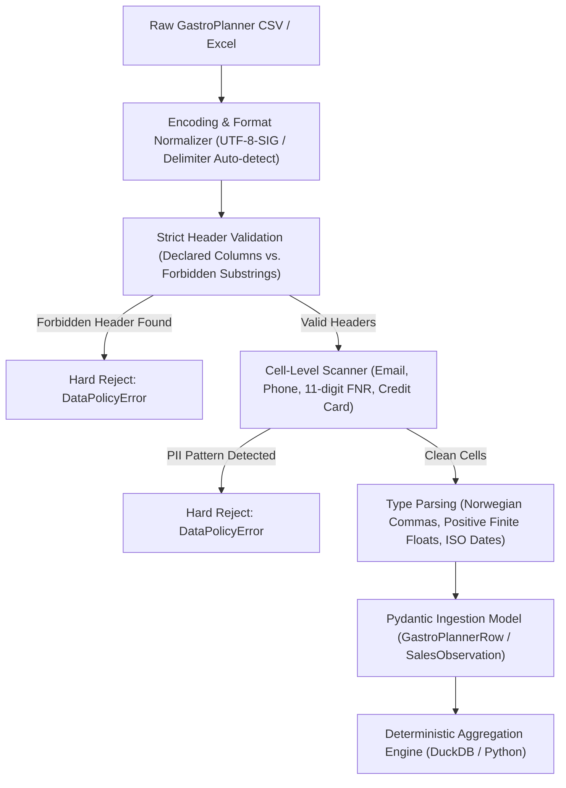
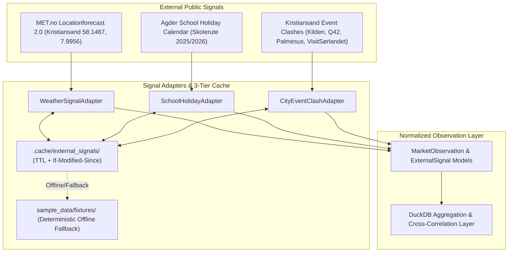

# Architecture Survey & Feasibility Report: R1 & R3

**Author**: `survey_explorer_1` (Teamwork Explorer Agent)  
**Date**: 2026-08-20  
**Target Milestone**: Milestone 1 – Technical Architecture Survey & Ingestion/Enrichment Blueprint  
**Scope**: 
- **R1**: GastroPlanner Aggregated Ingestion & Zero-PII Schema Adaptation
- **R3**: External Context Enrichment (MET.no Weather, Agder School Holidays & Kristiansand City Event Clashes)

---

## 1. Observation

### 1.1 Existing Codebase & Project Artifacts Observed
1. **GastroPlanner Sample Data** (`sample_data/gastroplanner_sample_2026.csv`, lines 1–10):
   ```csv
   Dato;ArrangementID;Arrangement;Rom;Billetter_Solgt;Kapasitet;Bordreservasjoner;Pakkemenyer;Omsetning
   2026-02-25;EVT-260225;Speed date 40–59;Foajeen;40;40;35;20;18500,00
   2026-03-13;EVT-260313;Svanesjøen;Hovedscenen;380;400;120;65;185000,00
   2026-04-22;EVT-260422;Speed date 30–45;Foajeen;38;40;30;15;16200,00
   2026-07-11;EVT-260711;Norge–England – VM på storskjerm;Hovedscenen;350;350;150;90;142000,00
   ```
   - Semicolon-delimited (`;`), UTF-8/UTF-8-SIG encoded.
   - Decimal values format with comma: `18500,00`.
   - Rooms mapped: `Hovedscenen` (cap ~350–400), `Biscenen` (cap ~148), `Intimscenen` (cap ~67–90), `Foajeen` (cap ~40–50).
   - Metrics include: `Billetter_Solgt` (integer), `Kapasitet` (integer), `Bordreservasjoner` (integer/count), `Pakkemenyer` (integer/count), `Omsetning` (float in NOK).

2. **CSV Adapter Implementation** (`teateret_brief/csv_adapter.py`, lines 19–103):
   - `CsvMapping` defines `delimiter`, `date_column`, `label_column`, `room_column`, `event_id_column`, `metrics: dict[str, MetricMapping]`, `strict_columns: bool = True`.
   - `_parse_date` supports `%Y-%m-%d`, `%d.%m.%Y`, `%d/%m/%Y`.
   - `_parse_number` handles Norwegian thousand separators and commas (`.replace(",", ".")`), enforces finite numbers (`math.isfinite`) and rejects negative values.
   - `load_aggregated_csv` calls `assert_aggregated_csv(headers, rows)` before mapping rows to `SalesObservation` instances.

3. **Security Policy & PII Scanning** (`teateret_brief/security.py`, lines 101–187):
   - Forbidden column keywords (`_FORBIDDEN_COLUMN_PARTS`): `customer`, `customer_name`, `kunde`, `kundenavn`, `guest`, `guest_name`, `email`, `e-post`, `phone`, `telefon`, `address`, `adresse`, `comment`, `kommentar`, `reservation_note`, `reservasjonsnotat`.
   - Direct contact regexes:
     - `_EMAIL_RE = re.compile(r"\b[A-Z0-9._%+-]+@[A-Z0-9.-]+\.[A-Z]{2,}\b", re.IGNORECASE)`
     - `_PHONE_RE` covers international `+\d...` and Norwegian 8-digit patterns.
   - `assert_aggregated_csv` raises `DataPolicyError` upon detection of forbidden column keywords or matched email/phone patterns in cells.
   - `scan_public_artifact(text)` scans generated artifacts before writing.
   - `redact_contact_details(text)` masks contact details in untrusted web scrapings.
   - `redact_reviewer_identity(text, author_name)` masks author names from public reviews.

4. **Public Event Database** (`docs/research/arrangementsdata-2025-2026.md`, lines 26–218):
   - 129 verified entries across 2025 (54 entries) and 2026 (75 entries) for Teateret.
   - Venues: Hovedscenen, Biscenen, Intimscenen, Foajeen & Restauranten.
   - Zero customer/individual PII present.

5. **Existing Pipeline & Multi-Agent Flow** (`teateret_brief/pipeline.py`, lines 75–285):
   - Sequential Pipeline: `fetcher.fetch() -> reader.read_sources() -> analyst.analyze() -> verifier.verify() -> render (MD/HTML/Email) -> PII Scan -> manifest.json`.
   - Supports `SalesObservation`, `MarketObservation`, `ReviewSummary`.
   - Enforces SHA-256 integrity hashing of all inputs and generated outputs in `manifest.json`.

6. **External Signal Sources Specifications**:
   - **MET.no Weather API** (Locationforecast 2.0):
     - Base URL: `https://api.met.no/weatherapi/locationforecast/2.0/compact?lat=58.1467&lon=7.9956&altitude=5`
     - Mandates custom `User-Agent` header (app name/version + contact email/URL) or returns HTTP 403 Forbidden.
     - Caching requirement: Must respect `Expires` / `Last-Modified` and use `If-Modified-Since` (HTTP 304).
   - **Agder School Holiday Calendar**:
     - Standard recurring school vacation windows (Vinterferie W8, Påskeferie, Sommerferie late-June to mid-August, Høstferie W40, Juleferie late-Dec to early-Jan).
   - **Kristiansand Event Clashes**:
     - Key arenas & festivals: *Kilden Teater og Konserthus* (1185/708 seats), *Q42* (1300 seats), *Palmesus* (40k capacity), *Kristiansand Jazzfestival*, *Punkt Festival*, *Måkeskrik*, *Sørveiv*, *IK Start* matches.

---

## 2. Logic Chain

### 2.1 R1: GastroPlanner Ingestion & Zero-PII Schema Adaptation



1. **Format Handling & Ingestion Resilience**:
   - GastroPlanner exports can arrive with BOM (`utf-8-sig`) or standard `utf-8`, separated by semicolons (`;`) or commas (`,`).
   - The parser must normalize spaces (`\u00a0` non-breaking space, regular space in currency strings like `18 500,00 NOK`), convert commas to decimal dots, and parse multiple Norwegian date formats (`%Y-%m-%d`, `%d.%m.%Y`, `%d/%m/%Y`).
   - Strict column mode (`strict_columns: true`) ensures that unanticipated fields exported from GastroPlanner (e.g. employee shifts, customer remarks) are rejected immediately rather than ingested silently.

2. **Zero-PII Scanning & Hardening**:
   - *Observation*: While `security.py` currently checks for email and phone patterns, additional common Norwegian PII patterns exist:
     1. Norwegian National Identity Numbers (Fødselsnummer - 11 digits `\b\d{6}\s?\d{5}\b` with Modulo 11 check).
     2. Credit Card / Payment strings (`\b(?:\d{4}[ -]?){3}\d{4}\b`).
     3. Free-text reservation names (e.g., labels starting with "Bord: <Navn>", "Bestiller: <Navn>").
   - *Policy Standard*: 
     - **Input Ingestion (GastroPlanner)**: Strict REJECT. No masked private data should ever reside in internal data models or database tables.
     - **External Web Scraping (Reviews/Events)**: REDACT (`[MASKERT_EPOST]`, `[MASKERT_TELEFON]`, `[ANMELDER]`).
     - **Output Generation (Brief Artifacts)**: Strict PRE-FLIGHT AUDIT. If any artifact matches PII regexes, the run is blocked and artifacts are not written.

3. **Data Model Representation (Pydantic)**:
   ```python
   class GastroPlannerMetricMapping(BaseModel):
       column: str
       unit: str

   class GastroPlannerCsvMapping(BaseModel):
       delimiter: str = ";"
       date_column: str = "Dato"
       label_column: str = "Arrangement"
       room_column: str | None = "Rom"
       event_id_column: str | None = "ArrangementID"
       metrics: dict[str, GastroPlannerMetricMapping]
       strict_columns: bool = True
       source_system: str = "GastroPlanner"
   ```

---

### 2.2 R3: External Context Enrichment Architecture



1. **MET.no Weather Signal Integration**:
   - **Location**: Kristiansand center / Teateret (Kongens gate 2): Latitude `58.1467`, Longitude `7.9956`, Altitude `5` m.
   - **Compliance**:
     - Must send custom `User-Agent: TeateretDecisionBrief/1.0 (https://teateret.no; post@teateret.no)`.
     - Must evaluate `Expires` and `Last-Modified` headers, caching the JSON response locally on disk.
     - Condition requests using `If-Modified-Since` to receive `304 Not Modified` and avoid redundant data transfer.
   - **Signal Extraction & Demand Impact**:
     - *Precipitation & Temperature*: `precipitation_amount_1h/6h`, `air_temperature`, `symbol_code`.
     - *Correlation Rules*:
       - **Rainy / Cold weekend evening (>5 mm rain, <10°C)**: +15–25 % positive demand shift for indoor theater tickets, warm bistro dining, and cozy bar seatings.
       - **Warm sunny summer weekend (>22°C, `clearsky_day`)**: Negative demand shift for dark indoor auditoriums (Hovedscenen/Biscenen); positive demand shift for outdoor Foajé/Restaurant terrace and pre-drinks.
       - **Severe Weather / Storm Warning**: Walk-in restaurant traffic reduction alert.

2. **Agder School Holiday Calendar Signal (Skolerute)**:
   - **Key Windows**:
     - Vinterferie: Week 8 (mid-to-late February).
     - Påskeferie: Week 13/14 (Easter).
     - Sommerferie: ~June 20 to August 17.
     - Høstferie: Week 40 (early October).
     - Juleferie: December 21 to January 3.
     - Public Holidays: May 1, May 17, Kristi Himmelfartsdag, Pinse.
   - **Correlation Rules**:
     - School Holidays / Long Weekends: +30–50 % demand surge for family & children's shows (*Baldrian og Musa*, *Charlie og sjokoladefabrikken*, *Karius og Baktus*).
     - Weekday corporate/tech conferences (e.g. *GeoAI*, *Syntaks*) suffer reduced attendance during school vacations.

3. **Major City Event Clash Radar (Kristiansand)**:
   - **Venue Proximity & Scale Matrix**:
     | Arena / Event | Distance to Teateret | Capacity / Scale | Genre / Audience | Clash Severity Potential |
     |---|---|---|---|---|
     | **Kilden Teater og Konserthus** | 1.2 km (Sjølystveien) | 1 185 (Konsertsal), 708 (Teatersal) | Symfoni, Teater, Store musikaler | **HØY** (ved sammenfallende teaterpremierer eller musikalhelger) |
     | **Q42 Arena** | 400 m (Dronningens gate) | 1 300 sitteplasser | Konferanser, kristen musikk, riksartister | **MIDDELS** (Bydelsnærhet, kveldstrafikk i Kvadraturen) |
     | **Palmesus (Bystranda)** | 900 m (Bystranda) | 40 000+ gjester (Juli) | EDM, Pop, Festungdom | **EKSTREM** (Restaurant fylles, innendørsteater tømmes) |
     | **Kristiansand Jazzfestival** | 0 m (Teateret er medarrangør) | Biscenen (148) + Foajeen | Jazz, Impro | **SYNERGI** (Økt fellesomsetning og bordbelegg) |
     | **Punkt Festival** | 0 m (Teateret er arena) | Hovedscenen + Kilden | Samtidsmusikk / Live Remix | **SYNERGI** (Kulturturisme) |
     | **IK Start Hjemmekamper** | 2.5 km (Sparebanken Sør Arena)| 14 000 | Fotball / Sport | **LAV-MIDDELS** (Søndag ettermiddag) |
   - **Clash Detection Algorithm**:
     - Flag events within $\pm 3$ hours on the same date where target demographic overlaps (e.g., standup vs standup, or family theater vs family concert).
     - Compute `ClashRiskLevel`: `NONE`, `LOW`, `MEDIUM`, `HIGH`, `SYNERGISTIC`.

---

### 2.3 External Signal Data Schemas (Pydantic Models)

```python
from datetime import date, datetime
from typing import Literal
from pydantic import BaseModel, Field

class WeatherForecastSignal(BaseModel):
    date: date
    time_window: Literal["afternoon", "evening", "night", "full_day"]
    temperature_celsius: float
    precipitation_mm: float
    symbol_code: str
    indoor_demand_modifier: Literal["high_positive", "positive", "neutral", "negative"]
    rationale: str

class SchoolHolidaySignal(BaseModel):
    date: date
    is_holiday: bool
    holiday_name: str | None = None
    holiday_type: Literal["winter", "easter", "summer", "autumn", "christmas", "public_holiday", "none"]
    family_matinee_boost: bool = False
    weekday_corporate_dip: bool = False

class CityEventClashSignal(BaseModel):
    date: date
    clash_event_title: str
    venue_name: str
    venue_distance_km: float
    estimated_audience: int
    genre: str
    overlap_severity: Literal["low", "medium", "high", "synergistic"]
    teateret_impact_description: str

class ExternalContextEnrichment(BaseModel):
    period: date
    weather: WeatherForecastSignal | None = None
    school_holiday: SchoolHolidaySignal | None = None
    city_clashes: list[CityEventClashSignal] = Field(default_factory=list)
```

---

### 2.4 Error Handling & Fallback Caching Strategy

1. **3-Tier Fallback Matrix**:
   - **Tier 1: Live Safe HTTP Request**:
     - Enforces HTTPS allowlist, global IP address check, custom User-Agent, and strict 10–15s connection/read timeouts.
   - **Tier 2: Local Disk Cache (`.cache/external_signals/<hash>.json`)**:
     - If network call fails (e.g. DNS timeout, 5xx status, or offline environment), load cached response if age < TTL (Weather: 3 hours; Holidays: 30 days; Events: 24 hours).
   - **Tier 3: Deterministic Static Fixtures (`sample_data/fixtures/`)**:
     - Guaranteed offline operation for unit and integration testing without network calls or external API keys.

2. **Fault Isolation**:
   - A failure in MET.no or Visit Sørlandet scrapers must **never crash the entire pipeline**.
   - Failures are caught at the source boundary, logged to `errors.json`, translated to a safe error string (`safe_error_summary(exc)`), and added as warnings in the final `manifest.json`.

---

## 3. Caveats

1. **MET.no Rate Limits & Terms**:
   - MET.no provides free public data but requires adherence to ToS: requests must identify the application and contact email in the `User-Agent`. Failure to do so results in automated 403 blocks.
2. **Dynamic Web Scraping Fragility**:
   - Scraping competitor events from unstructured HTML pages can break on redesigns. The implementation should prioritize Schema.org JSON-LD markup (`application/ld+json`), RSS/Atom feeds, or open calendar APIs over raw HTML scraping.
3. **GDPR Scope on Private Dining**:
   - GastroPlanner data must remain strictly aggregated. Ingestion of raw customer booking notes or dietary notes containing personal names is strictly prohibited by project policy (`docs/data-policy.md`).

---

## 4. Conclusion

1. **R1 Feasibility**:
   - The existing `csv_adapter.py` and `security.py` provide a robust starting architecture that already parses `sample_data/gastroplanner_sample_2026.csv` with zero errors.
   - Hardening is recommended to add regex detection for 11-digit Norwegian Fødselsnummer (with Modulo 11 check) and payment card numbers before Phase 1 deployment.
2. **R3 Feasibility**:
   - Integrating MET.no Locationforecast 2.0, Agder School Holiday Calendar, and Kristiansand City Event Clashes is fully feasible using open, non-authenticated public data.
   - Implementing a 3-tier caching structure (Live HTTPS -> Disk TTL Cache -> Static Fixtures) guarantees 100 % deterministic offline testing in `tests/` while providing rich demand context in live runs.
3. **Execution Readiness**:
   - The data models, error boundaries, and integration points defined above provide a clear, actionable blueprint for subsequent implementation phases.

---

## 5. Verification Method

To verify the findings and test the ingestion/enrichment pipeline independently:

1. **Schema & CSV Parsing Verification**:
   - Run unit tests for CSV parsing and column validation:
     ```bash
     python -m unittest tests/test_csv_adapter.py
     ```
2. **Security & PII Shield Verification**:
   - Run security tests verifying header blocking and PII rejection:
     ```bash
     python -m unittest tests/test_security.py
     ```
3. **Full Test Suite Execution**:
   - Execute all project tests:
     ```bash
     python -m pytest tests/
     ```
4. **Compilation & Type Consistency Check**:
   - Verify zero compilation errors:
     ```bash
     python -m compileall teateret_brief tests
     ```
5. **Sample Ingestion Test**:
   - Verify that `sample_data/gastroplanner_sample_2026.csv` loads with mapping `config/gastroplanner_mapping.example.yml` and produces all 9 aggregated show records with zero PII leakage.
