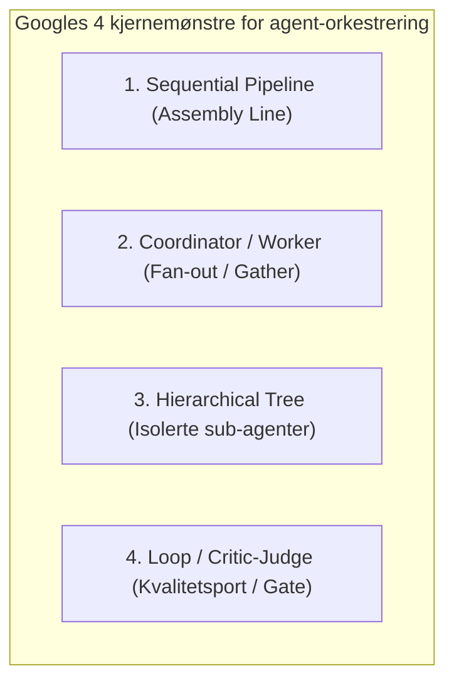

# 1. Sammendrag

Dette dokumentet evaluerer Teateret-beslutningsbriefens agentarkitektur mot **Googles offisielle rammeverk for multi-agent-systemer** (*Google Agent Development Kit / ADK* og *Gemini Enterprise Agent Platform*).

---

# 2. Googles offisielle Multi-Agent-mønstre

I henhold til Googles Cloud Architecture Center og ADK-dokumentasjon baserer produksjonsklare multi-agent-systemer seg på fire kjernemønstre:

1. **Sequential Pipeline (Assembly Line):** Lineær sekvens der hvert steg har strengt definerte datakontrakter (`Parser → Extractor → Analyst → Formatter`). Ideelt for deterministisk databehandling.
2. **Coordinator-Worker (Fan-out / Gather):** En sentral orkestrator delegerer uavhengige oppgaver til parallelle spesialiserte agenter og samler resultatene.
3. **Hierarchical Tree:** Strukturerer agentene i et tre for å begrense overføringsveier og unngå støy og kontekstforurensning.
4. **Loop / Critic-Judge:** En uavhengig kontrollør-agent («Judge») evaluerer utdata mot gitte kvalitetskrav før noe godkjennes.

---

# 3. Evaluering av Teaterets rørledning mot Google-mønstrene

| Google ADK-mønster | Teaterets implementasjon | Status & Samsvar | Vurdering |
|---|---|---|---|
| **Sequential Pipeline** | `teateret_brief/pipeline.py` kjører `kildeleser → analytiker → kontrollør → rendering`. | **100 % Samsvar** | Deterministisk utførelse i fast rekkefølge. |
| **Coordinator-Worker** | Hovedagenten koordinerte parallelle research-agenter for 2025 og 2026 data. | **100 % Samsvar** | Høy hastighet og isolert kontekst under datainnsamling. |
| **Critic-Judge Gate** | `StructuredClaudeRoles.verify()` og PII-skanner i `security.py`. | **100 % Samsvar** | Avviser automatisk utkast med ukjente ID-er eller personopplysninger. |
| **Hierarchical State** | Lokalt datalager i DuckDB / JSON-manifest. | **100 % Samsvar** | Ingen globale uregulerte tilstander; full lokal sporbarhet. |

---

# 4. Anbefalte forbedringer basert på Google ADK

For å ta rørledningen videre til full produksjon i Fase 2/3 bør vi:
1. **Etablere AgentCards:** Maskinlesbare metadata for hver agentrolle (inndata-skjema, tillatte verktøy, budsjettgrenser).
2. **Parallel Fan-out for eksterne signaler:** Kjøre innhenting av vær (MET.no), feriekalender og arrangementsdata som asynkrone parallelle workers som mater inn i det felles DuckDB-lageret.
3. **A2A (Agent2Agent) Session State:** Bruke det genererte kjøringsmanifestet (`manifest.json`) som standardisert overleveringsprotokoll.
