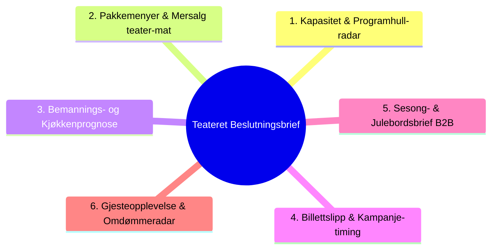

# 1. Bakgrunn og Forretningskontekst

Teateret i Kristiansand er et kombinert kultur- og serveringshus med fire scener/rom (Hovedscenen, Biscenen, Intimscenen, Foajeen) samt restaurant og barer.

For at beslutningsbriefen skal gi maksimal avkastning for Amir og ledergruppen, utvider vi her bruksområdene fra ren billettstatistikk til **seks konkrete, målbare use caser** der GastroPlanner-data og åpne markedssignaler løser reelle drifts- og forretningsutfordringer.

---

# 2. Oversikt over de 6 Use Casene

---

### Use Case 1: «Ledig Kapasitet & Programhull-radar» (Sal og Scene)
* **Problemstilling:** Enkelte scener/ukedager (særlig tirsdager, onsdager og søndager) står "mørke" eller har < 40 % belegg. Faste lokalkostnader løper uten inntekter.
* **Datagrunnlag:** GastroPlanner arrangementskapasitet + arrangementskalender per rom.
* **Ukentlig beslutning:** Identifisere ledige tidsluker 3–6 uker frem i tid og foreslå lavterskelkonsepter (quiz, speed dating, standup-open mic, vinsmaking eller utleie til næringslivet).
* **Målbar verdi:** 15 000 – 40 000 kr i ekstra dekningsbidrag per aktivert kveld.
* **Fase:** **Fase 1 (Pilot)**.

---

### Use Case 2: «Pakkemenyer & Mersalgs-optimalisering» (Restaurant & Teater)
* **Problemstilling:** Mange teatergjester kjøper kun billett og forlater huset rett etter forestilling, eller skaper kaos i baren i pausen fordi ingenting er forhåndsbestilt.
* **Datagrunnlag:** GastroPlanner Pre-order / Pakkesalg målt mot solgte teaterbilletter.
* **Ukentlig beslutning:** Identifisere forestillinger med lav pakkeoppslutning (< 20 %) og sende ut en automatisert "Pausesservering / Teatermiddag"-påminnelse til billettinnehavere 48 timer før show.
* **Målbar verdi:** Øke snittomsetning per gjest med 75–150 kr. Ved 300 gjester = 22 500 – 45 000 kr i økt bruttoomsetning per forestilling.
* **Fase:** **Fase 1/2**.

---

### Use Case 3: «Bemannings- og Kjøkkenprognose» (Driftsoptimalisering)
* **Problemstilling:** Kjøkkenet og baren opplever enten underbemanning (lange køer, tapt salg, stress) eller overbemanning (unødvendige lønnskostnader på rolige kvelder).
* **Datagrunnlag:** Aggregert gjesteantall per time fra GastroPlanner (forhåndsbestilte bord + forhåndsbestilte retter + arrangementsstørrelse).
* **Ukentlig beslutning:** Mandag morgen leverer briefen en presis bemanningsprognose for kommende uke (f.eks. «Fredag: 150 bord + 350 på Hovedscenen krever full barstyrke kl. 17:30–19:00 og i pausen kl. 20:45»).
* **Målbar verdi:** 5–10 % reduksjon i unødvendige timelønninger og eliminering av tapt barsalg under rushtid.
* **Fase:** **Fase 1**.

---

### Use Case 4: «Billettslipp & Kampanje-timing» (Markedsføring)
* **Problemstilling:** Markedsføringsbudsjettet spres tynt utover alle arrangementer uten hensyn til faktisk salgsfart.
* **Datagrunnlag:** Ukentlig salgsvekstkurve per arrangement fra GastroPlanner + regionale søketrender i Agder (Google Trends).
* **Ukentlig beslutning:** Allokere annonsekroner dynamisk til de 2–3 arrangementene som ligger bak salgsmålet 2 uker før arrangementsdato (f.eks. Sommerstandup med 60 ledige plasser).
* **Målbar verdi:** Fylle 15–30 ekstra seter per oppsetning = 5 000 – 12 000 kr per forestilling med minimal annonsekostnad.
* **Fase:** **Fase 1/2**.

---

### Use Case 5: «Sesong- og Julebordsbrief» (B2B & Gruppebookinger)
* **Problemstilling:** Høysesongene (julebord nov/des, sommeravslutninger mai/juni) krever tidlig fylling av store bord og selskapslokaler.
* **Datagrunnlag:** Historisk GastroPlanner-booking og tidlige reservasjoner fra selskaper og større grupper.
* **Ukentlig beslutning:** Følge opp ubookede datoer tidlig på høsten (september/oktober) med direkte salgsfremstøt mot bedriftskunder i Kristiansand-regionen.
* **Målbar verdi:** Sikre 100 % restaurant- og arrangementsbelegg på lukrative julebordskvelder (verdi: 100 000+ kr per kveld).
* **Fase:** **Fase 2**.

---

### Use Case 6: «Gjesteopplevelse & Omdømmeradar» (Sentiment & Kvalitet)
* **Problemstilling:** Dårlige gjesteopplevelser (f.eks. kald mat, lang kø i pausen eller dårlig akustikk) oppdages for sent dersom ledelsen ikke systematisk leser tilbakemeldinger.
* **Datagrunnlag:** Offentlige Google-anmeldelser og stjernevurderinger (hentet gratis) koblet sammen med hvilke oppsetninger/kvelder som hadde avvik.
* **Ukentlig beslutning:** Fange opp ukentlige trender i gjestetilfredshet og iverksette korrigerende tiltak før neste helg.
* **Målbar verdi:** Bevaring av Teaterets posisjon som topp-rangert kultur- og serveringssted i Kristiansand.
* **Fase:** **Fase 2 (Google-sporet)**.

---

# 3. Forretningsmessig ROI og Prisingsmatrise

| Use Case | Kompleksitet | Nødvendig kilde | Forventet ukentlig nytte | Pilot vs. Produksjon |
|---|---|---|---|---|
| **1. Programhull-radar** | Lav | GastroPlanner CSV + Program | Fylle mørke scener | Inngår i Pilot (10 000 kr) |
| **2. Pakkemenyer / Mersalg** | Middels | GastroPlanner CSV (Pakkekolonne) | +15–30 % serveringsomsetning | Inngår i Pilot (10 000 kr) |
| **3. Bemanningsprognose** | Lav | GastroPlanner CSV (Bord/Gjester) | Redusere overtid / optimalisere vaktlister | Inngår i Pilot (10 000 kr) |
| **4. Kampanje-timing** | Middels | GastroPlanner CSV + Salgsvekst | Øke fyllingsgrad 5–15 % | Inngår i Pilot (10 000 kr) |
| **5. Julebord & B2B** | Middels | GastroPlanner Historikk | Fylle høysesong tidlig | Fase 2 |
| **6. Omdømmeradar** | Middels | Google Business Profile (gratis) | Tidlig varsel om driftsproblemer | Fase 2 |

---

# 4. Anbefaling for neste steg

1. **Pilottilbudet (Fase 1 – ~10 000 kr):**
   - Levere ukentlig beslutningsbrief som dekker **Use Case 1, 2, 3 og 4** basert på én ukentlig GastroPlanner CSV-eksport.
2. **Produksjonsopsjon (Fase 2/3 – 20 000 – 35 000 kr):**
   - Automatisert rapportinnsamling via e-post/API, integrasjon av Use Case 5 & 6 (Google Sentiment), og lokal interaktiv Claude MCP-server for ad-hoc ledelsesspørsmål.
